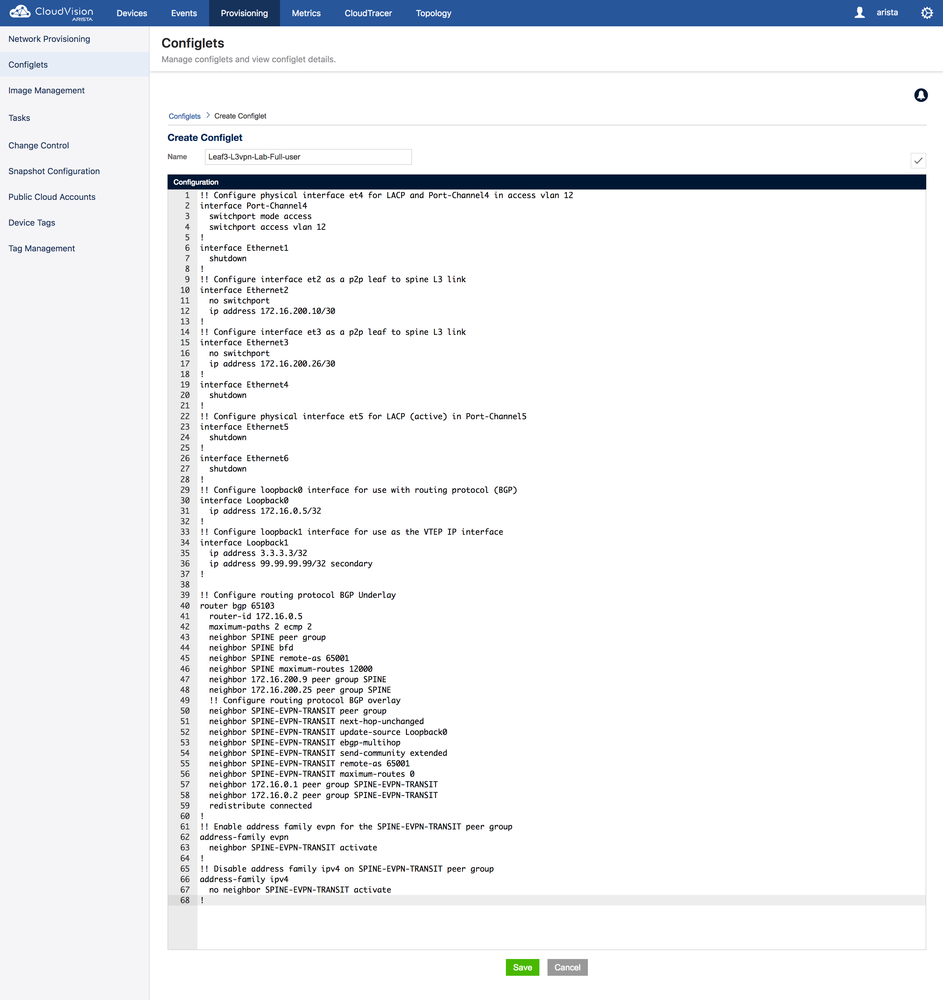
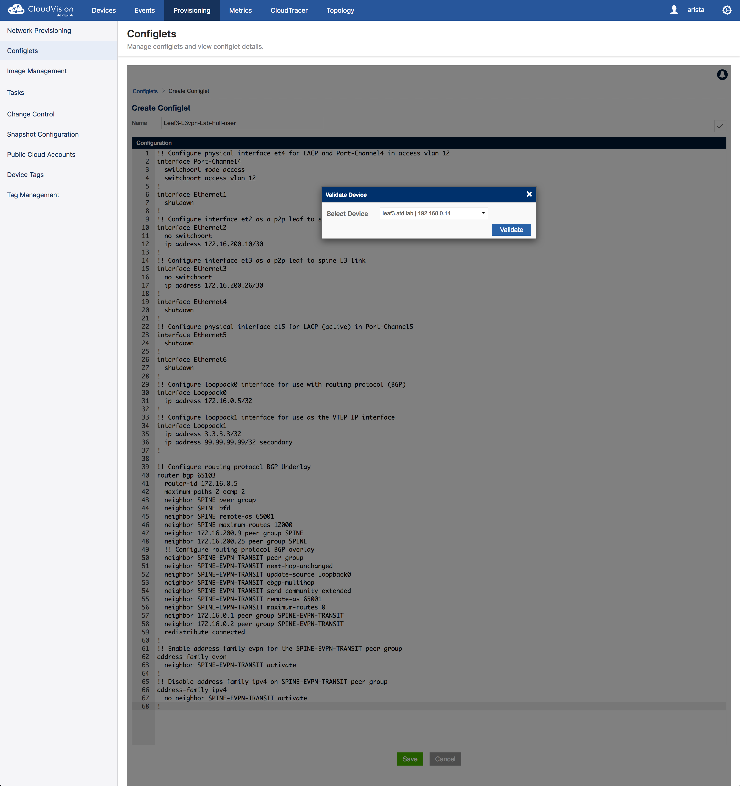
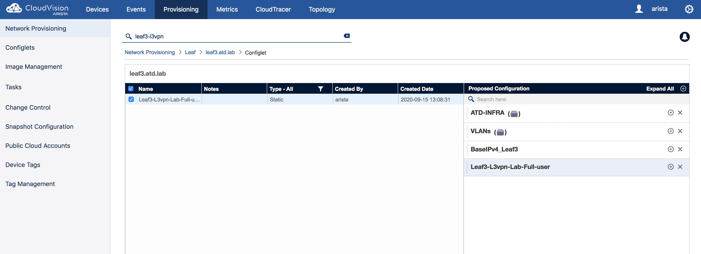
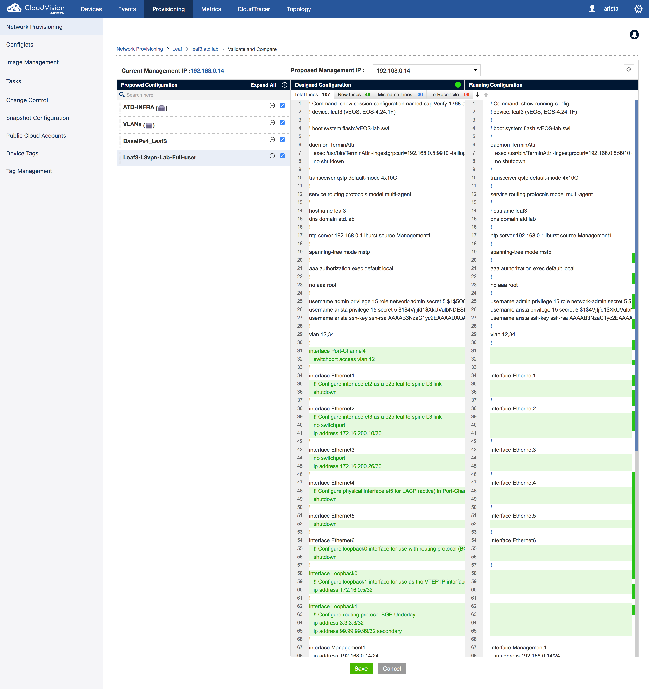
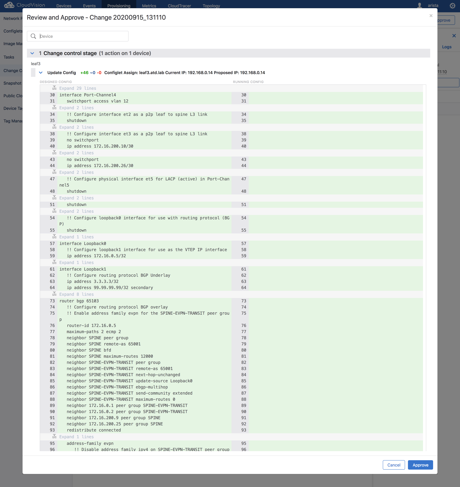
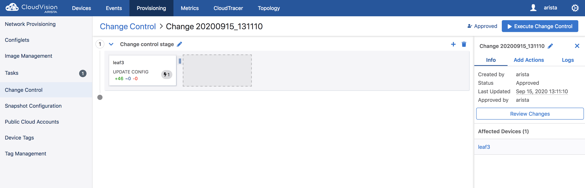
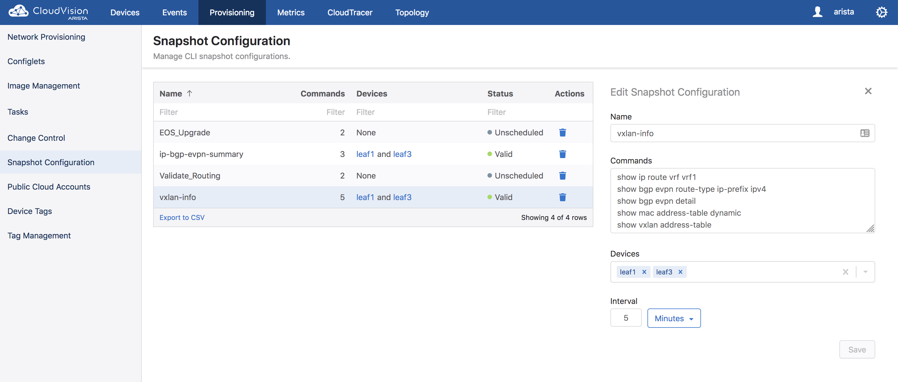
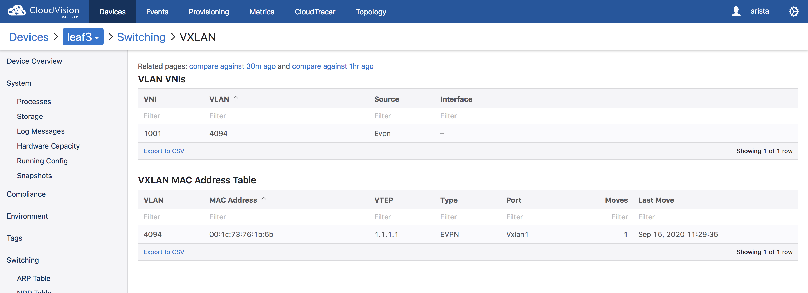
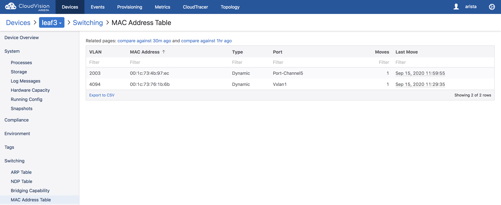
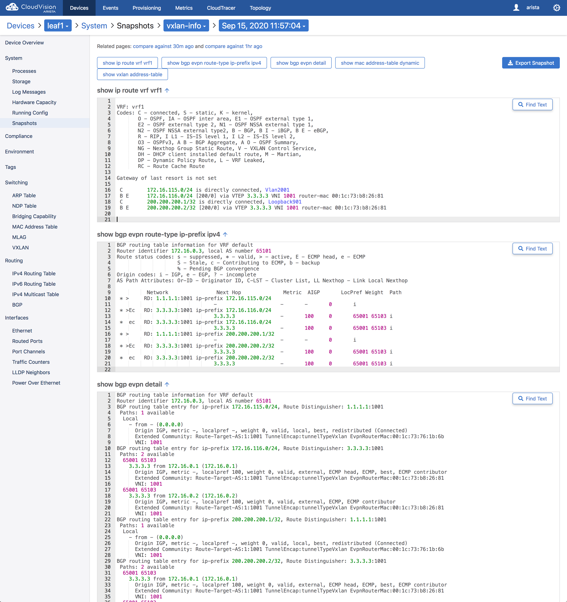

.. # define a hard line break for HTML
.. |br| raw:: html

    

L3 EVPN
=======

1. Log into CloudVision and find **leaf3** on the **Devices** page

* The username to access CloudVision is ``arista`` and the password is ``{REPLACE_ARISTA}``
   
* Search for ``leaf3`` in the **Device** column of the **inventory** table.

.. image:: images/cvp-l3vpn/leaf3-inventory-table.png
    :align: center
    :width: 50 %
|br|

* Click on **leaf3**
|br|

2. Review the current **running-config** routing agent information in CVP

* Click on **Running Config** in the left selection column under **Device Overview**

.. image:: images/cvp-l3vpn/leaf3-l3vpn-running-config.png
    :align: center
    :width: 50%
|br|

* Verify that ``service routing protocols model multi-agent`` line is in the current **running-config**
|br|

3. Review the current VXLAN information in CVP

* Click on **VXLAN** in the left selection column under **Switching**

.. image:: images/cvp-l3vpn/leaf3-l3vpn-vxlan-pre.png
    :align: center
    :width: 50%
|br|

* **Note:** leaf3 currently has no VXLAN configuration
|br|

4. Create the EVPN L3VPN configlet

* Click on **Provisioning**, click on **Configlets** in the left selection column
* Click the **+** sign in the Configlets list toolbar

.. image:: images/cvp-l3vpn/leaf3-l3vpn-configlet-list.png
    :align: center
    :width: 50%
|br|

* Create a configlet called ``Leaf3-l3vpn-Lab-Full-user``

.. code-block:: text

    !! Configure physical interface et4 for LACP and Port-Channel4 in access vlan 12
    interface Port-Channel4
      switchport mode access
      switchport access vlan 12
    !
    interface Ethernet1
      shutdown
    !
    !! Configure interface et2 as a p2p leaf to spine L3 link
    interface Ethernet2
      no switchport
      ip address 172.16.200.10/30
    !
    !! Configure interface et3 as a p2p leaf to spine L3 link
    interface Ethernet3
      no switchport
      ip address 172.16.200.26/30
    !
    interface Ethernet4
      shutdown
    !
    !! Configure physical interface et5 for LACP (active) in Port-Channel5
    interface Ethernet5
      shutdown
    !
    interface Ethernet6
      shutdown
    !
    !! Configure loopback0 interface for use with routing protocol (BGP)
    interface Loopback0
      ip address 172.16.0.5/32
    !
    !! Configure loopback1 interface for use as the VTEP IP interface
    interface Loopback1
      ip address 3.3.3.3/32
      ip address 99.99.99.99/32 secondary
    !

    !! Configure routing protocol BGP Underlay
    router bgp 65103
      router-id 172.16.0.5
      maximum-paths 2 ecmp 2
      neighbor SPINE peer group
      neighbor SPINE bfd
      neighbor SPINE remote-as 65001
      neighbor SPINE maximum-routes 12000
      neighbor 172.16.200.9 peer group SPINE
      neighbor 172.16.200.25 peer group SPINE
      !! Configure routing protocol BGP overlay
      neighbor SPINE-EVPN-TRANSIT peer group
      neighbor SPINE-EVPN-TRANSIT next-hop-unchanged
      neighbor SPINE-EVPN-TRANSIT update-source Loopback0
      neighbor SPINE-EVPN-TRANSIT ebgp-multihop
      neighbor SPINE-EVPN-TRANSIT send-community extended
      neighbor SPINE-EVPN-TRANSIT remote-as 65001
      neighbor SPINE-EVPN-TRANSIT maximum-routes 0
      neighbor 172.16.0.1 peer group SPINE-EVPN-TRANSIT
      neighbor 172.16.0.2 peer group SPINE-EVPN-TRANSIT
      redistribute connected
    !
    !! Enable address family evpn for the SPINE-EVPN-TRANSIT peer group
    address-family evpn
      neighbor SPINE-EVPN-TRANSIT activate
    !
    !! Disable address family ipv4 on SPINE-EVPN-TRANSIT peer group
    address-family ipv4
      no neighbor SPINE-EVPN-TRANSIT activate
    !

* Add the CLI text from above to the new configlet

|br|

* Validate configlet syntax on ``leaf3``

|br|

.. image:: images/cvp-l3vpn/leaf3-l3vpn-configlet-validate2.png
    :align: center
    :width: 50% 
|br|

5. Assign the EVPN configlet to ``leaf3``

* Click on **Provisioning**, then click on **Network Provisioning** in the left selection column
* Right click on **leaf3**, Click on **Manage->Configlets** and then search for ``Leaf3-l3vpn``

.. image:: images/cvp-l3vpn/leaf3-l3vpn-configlet-manage.png
    :align: center
    :width: 50% 
|br|

* Click the checkbox next to ``Leaf3-l3vpn-Lab-Full-user``

|br|

* Click **Validate**, review the new lines added to the **Designed Configuration**

.. image:: images/cvp-l3vpn/leaf3-l3vpn-configlet-assign-validate.png
    :align: center
    :width: 35% 
|br|

* click **Save**

|br|

* Click **Save** on the **Network Provisioning** main view

* **Note:** a Task will be generated

.. image:: images/cvp-l3vpn/leaf3-l3vpn-configlet-main-save.png
    :align: center
    :width: 50% 
|br|

6. Create a **Change Control** with the generated Task

* Click **Tasks** from the left selection column

* Click the checkbox next to the generated task from the pool of **Assignable Tasks**

.. image:: images/cvp-l3vpn/leaf3-l3vpn-cc-task.png
    :align: center
    :width: 50% 
|br|

* Click **+ Create Change Control with 1 Task**

.. image:: images/cvp-l3vpn/leaf3-l3vpn-cc-create-cc.png
    :align: center
    :width: 50% 
|br|

* Click **Review and Approve** on the newly created **Change Control**

|br|

* Click **Execute Change Control** in upper right of the UI

|br|

* Click **Execute** in the resulting confirmation dialog box

.. image:: images/cvp-l3vpn/leaf3-l3vpn-cc-execute-confirm.png
    :align: center
    :width: 50% 
|br|

7. Verify the EVPN BGP protocol overlay

* **Note:** This verification step can also be done on the CLI of ``leaf3`` 
* Click **Provisioning**, then click **Snapshot Configuration**

.. image:: images/cvp-l3vpn/leaf3-l3vpn-snapshot-config.png
    :align: center
    :width: 50% 
|br|

* Click **or create a new configuration** in the center of the **Snapshot Configuration** screen

.. image:: images/cvp-l3vpn/leaf3-l3vpn-snapshot-config-new.png
    :align: center
    :width: 50% 
|br|

* Under **Snapshot Configuration** enter ``ip-bgp-evpn-summary`` under Name 
* In the **Commands** dialog enter the following commands

.. code-block:: text

  show bgp evpn summary
  show ip bgp summary
  show ip route bgp

* Under devices, select ``leaf3``

.. image:: images/cvp-l3vpn/leaf3-l3vpn-snapshot-config-content.png
    :align: center
    :width: 50% 
|br|

* Click **Save**

* Click **Devices**, then click **leaf3**
* Click **Snapshots** in the left selection column
* Click **ip-bgp-evpn-summary** 
* **Note:** Under ``show bgp evpn summary`` you should see that there are two **overlay** BGP peers, peered with the loopback0 interface IP address
* **Note:** Under ``show ip bgp summary`` you should see that there are two **underlay** BGP peers, peered with the p2p interfaces (Et2 & Et3) IP addresses
* **Note:** Under ``show ip route bgp`` you should see that there are a number of ECMP routes to networks via the p2p interfaces (ET2 & ET3) of the peers  

.. image:: images/cvp-l3vpn/leaf3-l3vpn-snapshot-ip-bgp-evpn-summary.png
    :align: center
    :width: 50% 
|br|

8. Add the L3VPN VXLAN configuration to the previously created configlet ``Leaf3-l3vpn-Lab-Full-user``

* Click **Provisioning**, then click **Configlets**
* Search for ``l3vpn`` then click **Leaf3-l3vpn-Lab-Full-user**
* Click the **edit** button and add the following configuration lines in **bold** below, to the configlet created in step (4.)
* **Note:** For simplicity add the new lines in the same position and order as they appear in **bold** below 
* **Note:** This step will add an L2VPN to ``leaf3`` to extend VLAN 12 using VXLAN from ``leaf3`` to ``leaf1``

.. image:: images/cvp-l3vpn/leaf3-l3vpn-edit-configlet.png
    :align: center
    :width: 50% 
|br|

.. raw:: html
 
 <pre>
    <b>vrf instance vrf1
    !
    ip routing vrf vrf1
    !
    interface Port-Channel5
    switchport access vlan 2003
    no shutdown</b>
    !
    interface Ethernet1
      shutdown
    !
    !! Configure interface et2 as a p2p leaf to spine L3 link
    interface Ethernet2
      no switchport
      ip address 172.16.200.10/30
    !
    !! Configure interface et3 as a p2p leaf to spine L3 link
    interface Ethernet3
      no switchport
      ip address 172.16.200.26/30
    !
    !! Configure physical interface et4 for LACP (active) in Port-Channel4
    interface Ethernet4
      channel-group 4 mode active
      lacp timer fast
    !
    interface Ethernet5
      shutdown
    !
    !! Configure loopback0 interface for use with routing protocol (BGP)
    interface Loopback0
      ip address 172.16.0.5/32
    !
    !! Configure loopback1 interface for use as the VTEP IP interface
    interface Loopback1
      ip address 3.3.3.3/32
      ip address 99.99.99.99/32 secondary
    !
    <b>interface Loopback901
    vrf vrf1
    ip address 200.200.200.2/32
    !
    interface Vlan2003
    mtu 9000
    no autostate
    vrf vrf1
    ip address virtual 172.16.116.1/24
    !
    interface Vxlan1
    vxlan source-interface Loopback1
    vxlan udp-port 4789
    vxlan vrf vrf1 vni 1001</b>
    !
    !! Configure routing protocol BGP Underlay
    router bgp 65103
      router-id 172.16.0.5
      maximum-paths 2 ecmp 2
      neighbor SPINE peer group
      neighbor SPINE bfd
      neighbor SPINE remote-as 65001
      neighbor SPINE maximum-routes 12000
      neighbor 172.16.200.9 peer group SPINE
      neighbor 172.16.200.25 peer group SPINE
      !! Configure routing protocol BGP overlay
      neighbor SPINE-EVPN-TRANSIT peer group
      neighbor SPINE-EVPN-TRANSIT next-hop-unchanged
      neighbor SPINE-EVPN-TRANSIT update-source Loopback0
      neighbor SPINE-EVPN-TRANSIT ebgp-multihop
      neighbor SPINE-EVPN-TRANSIT send-community extended
      neighbor SPINE-EVPN-TRANSIT remote-as 65001
      neighbor SPINE-EVPN-TRANSIT maximum-routes 0
      neighbor 172.16.0.1 peer group SPINE-EVPN-TRANSIT
      neighbor 172.16.0.2 peer group SPINE-EVPN-TRANSIT
      redistribute connected
    !
    <b>vlan 12
    rd 3.3.3.3:12
    route-target both 1:12
    redistribute learned</b>
    !
    !! Enable address family evpn for the SPINE-EVPN-TRANSIT peer group
    address-family evpn
      neighbor SPINE-EVPN-TRANSIT activate
    !
    !! Disable address family ipv4 on SPINE-EVPN-TRANSIT peer group
    address-family ipv4
      no neighbor SPINE-EVPN-TRANSIT activate
    !
    <b>vrf vrf1
      rd 3.3.3.3:1001
      route-target import evpn 1:1001
      route-target export evpn 1:1001
      redistribute connected
      redistribute static</b>
    </pre>

* Repeat the process described in step (6.) to push the additional configuration to ``leaf3``
|br|

9. Verify l3vpn VXLAN operation with CVP Telemetry

* Using the method described in step (7.), create a new snapshot called ``vxlan-info``

  **Note:** This verification can also be done on the CLI of ``leaf1`` and ``leaf3``

* Select ``leaf1`` and ``leaf3`` under the **Devices** dropdown of the new Snapshot configuration

* Add the following commands to the **Commands** field of the new snapshot

.. code-block:: text

  show ip route vrf vrf1
  show bgp evpn route-type ip-prefix ipv4
  show bgp evpn detail
  show mac address-table dynamic
  show vxlan address-table

* Wait 5-10 minutes you will see the snapshot data populated 

  **Note:** wait for the snapshot to run and until after you ping from ``host1`` to ``host2`` before viewing this snapshot

.. image:: images/cvp-l3vpn/leaf3-l3vpn-vxlan-info-snapshot-content.png
    :align: center
    :width: 50%
|br|

* From **Device** page **Inventory** click on **leaf3**
* Click on **VXLAN** in the left selection column under **Switching**

|br|

* Ping ``host2`` from ``host1``
    
.. code-block:: text

    host1#ping 172.16.116.100
    PING 172.16.116.100 (172.16.116.100) 72(100) bytes of data.
    80 bytes from 172.16.116.100: icmp_seq=1 ttl=62 time=226 ms
    80 bytes from 172.16.116.100: icmp_seq=2 ttl=62 time=217 ms
    80 bytes from 172.16.116.100: icmp_seq=3 ttl=62 time=327 ms
    80 bytes from 172.16.116.100: icmp_seq=4 ttl=62 time=351 ms
    80 bytes from 172.16.116.100: icmp_seq=5 ttl=62 time=339 ms

    --- 172.16.116.100 ping statistics ---
    5 packets transmitted, 5 received, 0% packet loss, time 63ms
    rtt min/avg/max/mdev = 217.817/292.550/351.391/57.955 ms, pipe 5, ipg/ewma 15.869/263.352 ms
    host1#

* Again, click on **VXLAN** in the left selection column under **Switching**

|br|

* **Note:** In addition to the VLAN to VNI Mappings, you will see an entry in the ``VXLAN MAC Address Table`` section

* Click on the **MAC Address Table** for ``leaf3`` in left selection column

|br|

* Review the snapshot ``vxlan-info`` created earlier in step (9.)
* **Note:** ``show ip route vrf vrf1`` shows the layer 3 network and vrf distributed by BGP EVPN
* **Note:** ``show bgp evpn route-type ip-prefix ipv4`` will show the type-5 ip-prefix being sent via BGP EVPN 
* **Note:** ``show bgp evpn detail`` shows information about the ip prefix, details about the route target, route distinguisher and EVPN router mac
* **Note:** ``show mac address-table dynamic`` and ``show vxlan address-table`` shows information about the EVPN router mac and VTEP

|br|
**LAB COMPLETE!**
